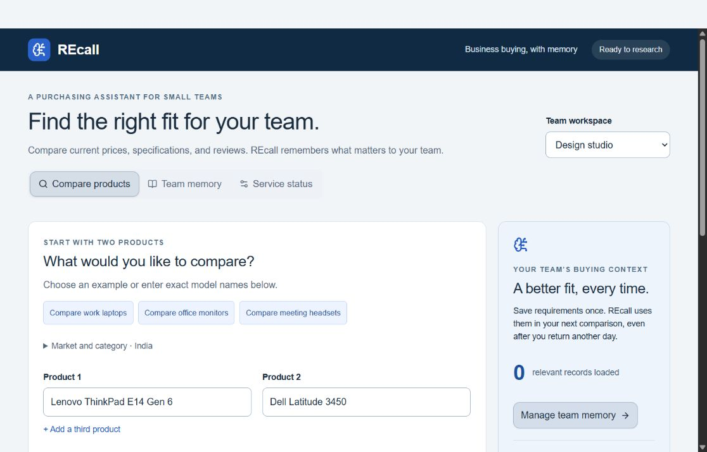
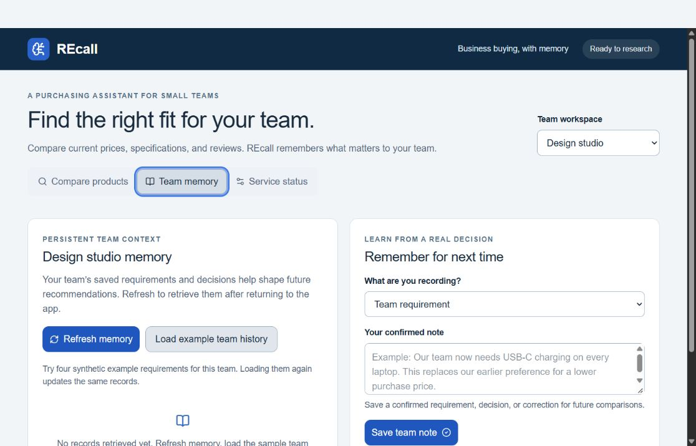
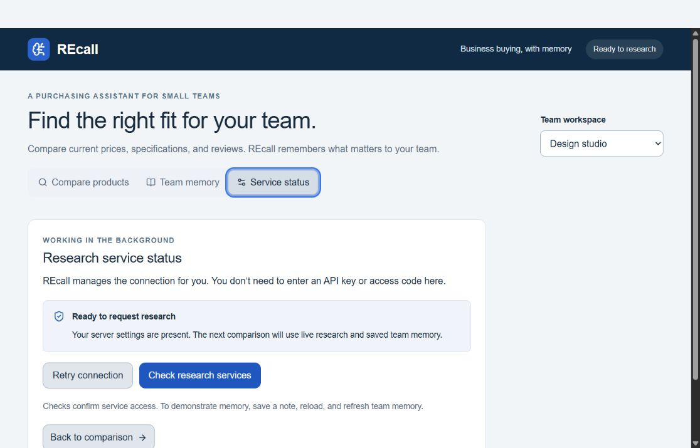
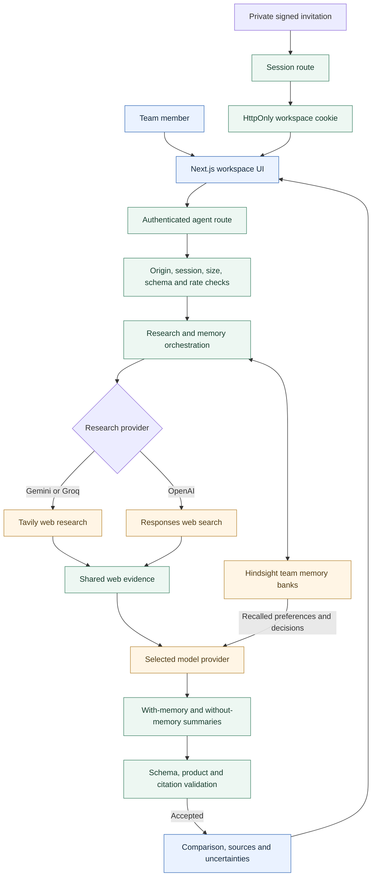
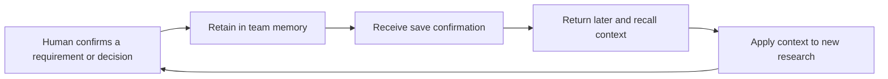

<div align="center">

# REcall

### Business buying, with memory.

Source-backed product research that remembers what matters to your team.

[Live application](https://r-ecall.vercel.app/) · [Architecture](ARCHITECTURE.md) · [Deployment guide](DEPLOYMENT.md) · [MIT license](LICENSE)

**Next.js · React · TypeScript · Hindsight · Gemini / Groq / OpenAI**

</div>

---

## Why REcall?

A product comparison starts with specifications. A useful business decision also needs context: the team's budget, warranty expectations, repair experiences, and requirements learned from previous purchases.

REcall combines web research with persistent team memory to compare work laptops, office monitors, and meeting headsets. It shows recommendations **with and without remembered context**, using the same research evidence, so the influence of memory is visible.

**People make the decision. REcall does not buy products or place orders.**

> **Demo access:** The hosted application requires a fresh, private workspace invitation from the owner. A public page loading successfully does not mean research services are available. See [hosted access](#hosted-access-and-deployment) before presenting.

## Product at a glance



*Actual hosted interface captured on September 30, 2026. This image shows the comparison form, not a completed research result.*

| Capability | What it does |
| --- | --- |
| Product research | Compare two or three exact product models against a market and business requirements. |
| Evidence-linked output | Return source links, trade-offs, uncertainties, and structured product comparisons. |
| Persistent memory | Retain confirmed requirements, decisions, and corrections with Hindsight. |
| Memory comparison | Show two generated views: one with recalled context and one without it. |
| Team separation | Keep Design studio and Operations team memory in separate banks within a workspace. |
| Output checks | Validate product identities, schema, and source/memory citation IDs; retry invalid output once. |
| Service visibility | Check model, research, and memory access from the Service status screen. |

## Evidence gallery

These are unedited interface captures from the deployed application. They document the visible UI state, not an end-to-end service certification.

<details>
<summary><strong>Team memory — save and retrieve purchasing context</strong></summary>



The screen exposes note retention, memory refresh, and synthetic example history. No records had been retrieved in this capture; persistence must be demonstrated with a save → reload → recall test.

</details>

<details>
<summary><strong>Service status — configuration readiness</strong></summary>



“Ready to request research” means server settings are present. It does **not** prove that model quota, research access, or memory persistence passed a live check. Use **Check research services**, then complete the workflow below.

</details>

## How the system fits together



**One comparison request:** recall relevant memory → retrieve web evidence → generate and validate the with-memory view → generate and validate the without-memory view → return both views with sources.

Both views share the request's evidence. Invalid generated output gets at most one regeneration attempt per view, using the same supplied evidence; repeated invalid output is rejected. Provider failures retain their own error meaning rather than being treated as validation failures.

### The memory loop



Memory captures preferences and experiences; it is **not evidence of current prices or specifications**. A saved correction adds context rather than guaranteeing deletion of an earlier record.

## Repository structure

```text
REcall/
├── app/
│   ├── page.tsx                    # Application entry point
│   └── api/
│       ├── agent/route.ts          # Compare, remember, seed, history, verify
│       └── session/route.ts        # Workspace invitation/session handling
├── components/
│   ├── recall-workspace.tsx        # Comparison, memory and status screens
│   └── ui/                        # Reusable interface components
├── lib/recall/
│   ├── core.ts                    # Schemas and comparison validation
│   ├── generation.ts              # Bounded regeneration and safe diagnostics
│   ├── live.ts                    # Research, model and Hindsight integration
│   └── session.ts                 # Signed access and process-local limits
├── data/team-history.json         # Eight labelled synthetic example records
├── public/                        # Favicon and README evidence images
├── scripts/invite.mjs             # Private workspace invitation generator
├── tests/generation.test.cjs      # Nine mocked generation regression tests
├── .env.example                   # Server-side configuration template
├── ARCHITECTURE.md                # Data flow and reliability boundaries
└── DEPLOYMENT.md                  # Hosting, private access and verification
```

## Quick start

### 1. Install

Use **Node.js 22.12 or later** and npm.

```bash
git clone https://github.com/surya-3699/REcall.git
cd REcall
npm ci
```

Copy [`.env.example`](.env.example) to `.env.local` using your editor or file manager. Keep credentials server-side; **never commit `.env.local` or put secrets in `NEXT_PUBLIC_*` variables**.

### 2. Configure services

For the Gemini path, configure Hindsight, Gemini, and Tavily. Choose a model your API project can access; the template's model name is a project default, not a guarantee of availability or quota.

| Purpose | Environment variables | When required |
| --- | --- | --- |
| Persistent memory | `HINDSIGHT_BASE_URL`, `HINDSIGHT_API_KEY` | All providers; use your account's exact API endpoint. |
| Bank namespace | `HINDSIGHT_BANK_PREFIX` | Optional; template uses `recall`. |
| Provider selection | `LLM_PROVIDER` | Set to `gemini`, `groq`, or `openai`. |
| Gemini generation | `GEMINI_API_KEY`, `GEMINI_MODEL` | Gemini path. |
| Groq generation | `GROQ_API_KEY`, `GROQ_MODEL` | Groq path, or an explicitly configured Gemini backup. |
| Web research | `TAVILY_API_KEY` | Gemini and Groq paths. |
| OpenAI generation/search | `OPENAI_API_KEY`, `OPENAI_MODEL`, `OPENAI_SEARCH_MODEL` | OpenAI path; models need the relevant structured-output/search capabilities. |
| Hosted access | `SESSION_SECRET` | Hosting; a private random secret of at least 24 characters. |

Leave unused provider keys blank. API access, billing, and rate limits belong to the configured provider accounts; setting a key does not itself establish usable capacity.

### 3. Start locally

```bash
npm run dev
```

Open [localhost:3000](http://localhost:3000). Loopback development can establish a local session automatically. Hosted access uses signed invitations instead.

## Demonstrate the full workflow

1. Open **Service status** and select **Check research services**.
2. Choose a team, then enter two exact product variants, the market, and requirements.
3. Run a comparison. Inspect linked evidence, unknowns, and the with-memory/without-memory views.
4. Under **Team memory**, save a confirmed requirement or decision and wait for the save receipt.
5. Reload the page, keep the same workspace/team, and refresh memory.
6. Run a later comparison and inspect whether the recalled context is used appropriately.

Example history is **synthetic**, not a record of real purchasing approvals or current product facts. Loading it again uses stable document IDs. Memory refresh retrieves relevant context; it is not a complete comparison archive.

## Hosted access and deployment

Deploy as a Node.js Next.js application over HTTPS. Put provider credentials and `SESSION_SECRET` in the host's private environment settings. Ensure the host can reach external services and supports the request duration; no particular free tier or hosting plan is guaranteed.

The owner generates an invitation from a private local `.env.local` containing the **same signing secret** as the deployment:

```bash
npm run invite -- https://r-ecall.vercel.app judges
```

Replace the URL if deploying elsewhere. `judges` is the workspace ID; use the same ID when people should share workspace memory. Invitations expire after **15 minutes** and successful access creates a **seven-day browser session**. Use the intended deployment domain consistently.

**Share invitations privately, never in this README, an issue, or a public recording.** See the [deployment guide](DEPLOYMENT.md) for setup and verification.

## Verification

```bash
npm test
npm run typecheck
npm run build
```

| Check | Evidence and scope |
| --- | --- |
| Generation regression suite | **9/9 passed** on September 30, 2026, against application code at `cfb14f5`. Tests use mocked generation; no live provider calls are implied. |
| TypeScript | `npm run typecheck` passed on the same checkout. |
| Production build | `npm run build` passed on the same checkout. This verifies compilation, not live API availability. |
| UI screenshots | Comparison, memory, and configuration-status screens captured from the hosted app. |
| Live end-to-end behavior | Not certified by these screenshots or mocked tests. Use the save → reload → recall → compare workflow with your configured services. |

The regression suite covers valid output, unsupported citations, uncited claims/reviews, incorrect products, fabricated memory references, bounded retries, malformed JSON diagnostics, and provider-error propagation.

## Security and operational boundaries

- Provider credentials stay on the server. Hosted routes require a signed workspace session and same-origin requests; session cookies are HttpOnly and use Secure on hosted deployments.
- Request schemas and a 16 KB JSON limit constrain accepted input. Citation-ID validation checks references, **not whether every cited claim is factually correct**.
- The rate limiter is process-local: it is not durable or shared across replicas. Add shared quota enforcement before relying on multi-instance limits.
- The agent has a 170-second overall budget; the route advertises a 240-second maximum. Hosting/provider limits may end requests earlier.
- Supported transient Gemini failures may use fallback models and an explicitly configured Groq backup. An **evidence-only preview** during an outage is not a completed AI recommendation. Authentication and quota errors may still fail the request.
- Web excerpts can be stale, incomplete, or refer to another regional variant. Review original sources before buying. The paired views illustrate context use; they are not a controlled quality benchmark.

## Contributing

Keep changes focused, avoid committing credentials, and run the verification commands before proposing a change. Include screenshots for interface changes and explain any effects on memory, evidence handling, or provider configuration.

## References and license

- [Hindsight source](https://github.com/vectorize-io/hindsight) and [documentation](https://hindsight.vectorize.io/)
- [System architecture](ARCHITECTURE.md) and [deployment guide](DEPLOYMENT.md)
- [MIT license](LICENSE) — copyright 2026 REcall Contributors
